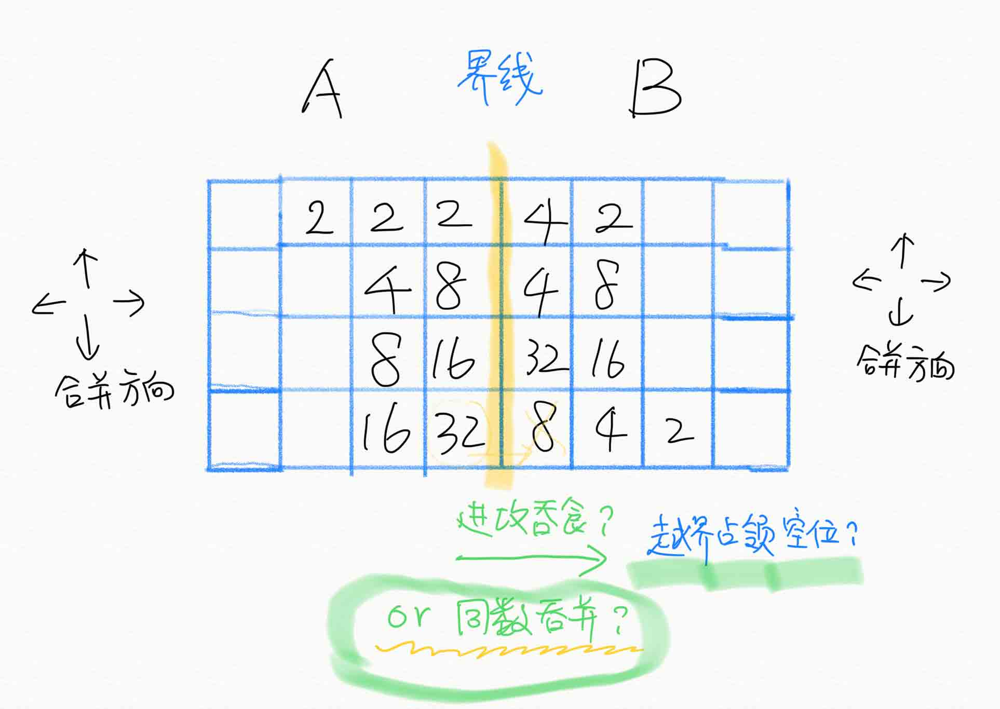

内测组请使用src文件夹中的round_match进行单循环赛测试
---

完整游戏规则文档已上传
---

# sessdsa.2048
2020地空数算实习作业选题

## 游戏背景
1v1对战版2048

## 游戏规则
AB队博弈。基本规则同2048游戏。

### **名词定义**:

棋盘：一个4行8列的游戏场地，在游戏开始时被分为两半，左、右半分属A、B两队。

棋子：本方领域中的非空方块。

方块合并：游戏操作，需要一个方向作为参数（上、下、左、右）。本方全部棋子向该方向运动，直到遇到**对方空格或对方棋子或已经停下的本方棋子**停下，如果其与遇到的棋子数值相等，将“吃掉”遇到的棋子，占据遇到的棋子原先的位置，并将自身数值修改为原数值的两倍。**如果有多种吃棋方式，沿合并方向靠前的棋子将优先结算；一个棋子如果吃掉了另一个棋子，在本操作内其不能再参与吃棋（吃或被吃）。**

**注记**：作为例子，设定合并方向向右：2、2、4 -> 4、4；4、2、2 -> 4、4；2、2、2、2 -> 4、4. 按现有实现，吃棋后立即归还占有的对方空格，再结算下一个棋子的吃棋。

### **游戏过程**:

游戏开始后，两队按照回合制轮流动作。 每一回合按四个阶段顺序执行

1.	先手方A队在某个空方格添加一个2方块；
2.	后手方B队在某个空方格添加一个2方块；
3.	先手方A队选择方块合并方向并方块合并；
4.	后手方B队选择方块合并方向并方块合并。

添加方块时可以选择其一：
1.  下到对手领域的指定空格中，棋子归对方所有（位置己方决定）；或者，
2.  下到自己领域的随机空格中，棋子归己方所有（位置由**确定**随机序列决定）

确定的随机性指：某队知道如果选择在己方下棋，棋子将出现的位置；但是该位置是由游戏开始前已经**公开**的随机序列和计算位置的算法计算而得到的，并不受本队控制。

## 场地建设：
技术组给出4*8的棋盘与全局信息
- 包含回合数、随机种子信息、计分与耗时等

棋盘需提供玩家当前局势信息

棋盘需接受玩家的：
- 添加棋子信息：自己or对方场地，放置位置
- 盘面方向移动信息：上下左右

## 终局条件分类
- 一方非法输出：记为对方胜/对方可继续游戏
- 一方耗时结束：记为对方胜/对方可继续游戏
- 一方无法移动：记为对方胜/对方可继续游戏
- 回合数耗尽：进入计分环节

## 计分方式：
- 基本计分方式：将双方终盘棋子降序排列，字典序大者胜。例：先手方有一个1024，四个256，其它小棋子；后手方有一个1024，一个512，其它小棋子，则后手方胜利。
- 考虑对先无法移动/耗尽时间者，进行分数惩罚。

## 资料链接
- [技术组](team.md)
