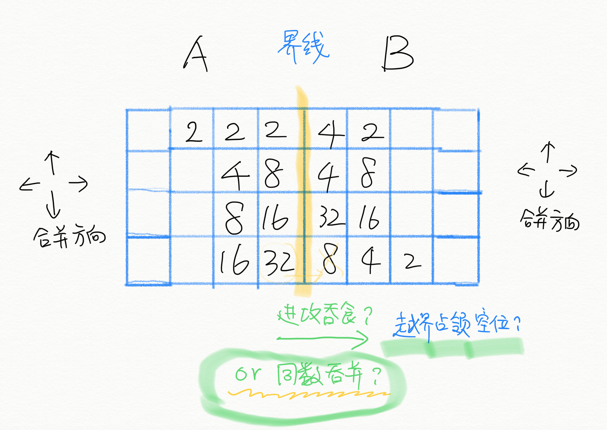

# sessdsa.2048
2020地空数算实习作业选题

## 游戏背景
1v1对战版2048

## 游戏规则
AB队博弈。基本规则同2048游戏。

### **名词定义**:

棋盘：一个4行8列的游戏场地，在游戏开始时被分为两半，左、右半分属A、B两队。

领域：属于本方的方格组成的集合。

边界：本方的领域中与对方领域相邻的方格组成的集合。

棋子：本方领域中的非空方块。

可并范围：本队的领域和对方的边界的并集。

方块合并：游戏操作，需要一个方向作为参数（上、下、左、右）。本方全部棋子向该方向运动，直到以下两种情况停下：1、即将越出可并范围；2、遇到已经停下的本方棋子或对方棋子。

对于情况2，如果这两个棋子数值相等，运动的棋子将“吃掉”停下的棋子，占据停下的棋子原先的位置，并将自身数值修改为原数值的两倍。如果沿合并方向存在多种吃棋方式，优先结算按该方向更靠前的棋子。

### **游戏过程**:

游戏开始后，两队按照回合制轮流动作。 每一回合按三个阶段顺序执行

1、决策阶段：此阶段分为四个步骤
1.	先手方A队在某个方格添加一个2方块；
2.	后手方B队在某个方格添加一个2方块；
3.	先手方A队选择方块合并方向；
4.	后手方B队选择方块合并方向。

添加方块时可以选择其一：
1.  下到对手棋盘的指定空格中（位置己方决定）；或者，
2.  下到自己棋盘的随机空格中（位置由**确定**随机序列决定）

注意，此阶段采取的任何决策均即时展示。

确定的随机性指：某队知道如果选择在己方下棋，棋子将出现的位置；但是该位置是由游戏开始前已经公开的随机序列和计算位置的算法计算而得到的，并不受本队控制。

2、合并阶段：按照决策阶段的结果，此阶段分为两个步骤
1.	先手方A队进行一次方块合并。
2.	后手方B队进行一次方块合并。

3、结算阶段：此阶段分为两个步骤
1.	某方棋子所占领的方格自动成为本方领域，不被双方棋子占领的方格归属不变
2.	若某方领域中没有空方格，且可并范围中没有数值相等的相邻方块，进入终局阶段。

## 场地建设：
技术组给出4*8的棋盘与全局信息
- 包含回合数、随机种子信息、计分与耗时等

棋盘需提供玩家当前局势信息

棋盘需接受玩家的：
- 添加棋子信息：自己or对方场地，放置位置
- 盘面方向移动信息：上下左右

## 终局条件分类
- 一方在方块合并前后棋盘没有发生变化：记为对方胜/对方可继续游戏
- 一方耗时结束：记为对方胜/对方可继续游戏
- 回合数耗尽：进入计分环节
- 双方均无法移动：进入计分环节

## 计分方式：
- 基本计分方式：将双方终盘棋子降序排列，字典序大者胜。例：先手方有一个1024，四个256，其它小棋子；后手方有一个1024，一个512，其它小棋子，则后手方胜利。
- 考虑对先无法移动/耗尽时间者，进行分数惩罚。

## 资料链接
- [技术组](team.md)
