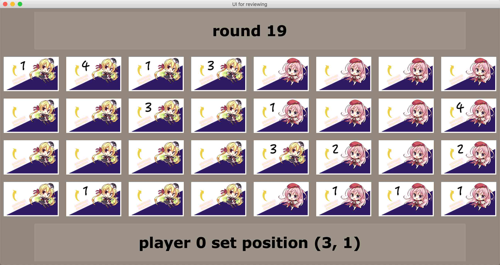

# src文档草案

## 基本介绍
此文件夹包含了[对战平台内核](plat.py)，[样例随机ai](player.py)，[复盘可视化](analyser.py)，[可供引用的帮助库](constants.py)，[隔离代码装置](secureclass.py)，[样例初级ai](less_stupid_player.py)（目前还需要修改接口）。

## 使用方法介绍
### 对战平台内核
```
from player import Player as Player0  # 先手
from player import Player as Player1  # 后手
```
从```player.py```中引用```Player```对象参与对战，直接运行即可开始比赛。实际比赛时则从参赛队伍的提交文件中引用。

运行界面出现
```
for complete record...(y/n): 
```
输入```y```可以查看完整对战记录。
运行界面出现
```
save record...(y/n): 
filename: 
```
输入```y```和```filename```可以保存对战记录为```filename.txt```文件，后者可以由```analyser.py```解析并可视化。

作为例子，一次实际记录如下
```
for complete record...(y/n): y
Squeezed text(4261 lines)
==================================================
total rounds are 255
score of player 0 is {1: 2, 2: 4, 3: 1, 4: 2, 5: 2, 6: 1, 7: 0, 8: 0, 9: 0, 10: 0, 11: 0, 12: 0, 13: 0}
score of player 1 is {1: 6, 2: 4, 3: 2, 4: 2, 5: 0, 6: 1, 7: 1, 8: 1, 9: 0, 10: 0, 11: 0, 12: 0, 13: 0}
time of player 0 is 0.022074460983276367
time of player 1 is 0.02318406105041504
player 0 violate
player 1 win
==================================================
save record...(y/n): y
filename: match
```
完整对局记录被折叠成```Squeezed text```，可以双击展开。
输出结果记录了总回合数、双方各级别的棋子数目、双方的用时、可能的意外终局（```violate```非法输出，```timeout```超时）和胜利者。
最后生成```match.txt```对局记录文件如下
```
name: match
time: 2020-04-21 13:25:54
****************basic record*****************
==================================
| timeout  | violator |  winner  |
----------------------------------
|   None   | player 0 | player 1 |
==================================
============================================================
|player|  1|  2|  3|  4|  5|  6|  7|  8|  9| 10| 11| 12| 13|
------------------------------------------------------------
|     0|  2|  4|  1|  2|  2|  1|  0|  0|  0|  0|  0|  0|  0|
------------------------------------------------------------
|     1|  6|  4|  2|  2|  0|  1|  1|  1|  0|  0|  0|  0|  0|
============================================================
***************complete record***************
...
```

### 样例随机ai
在此文件中，有对参赛ai接口的详细说明，如下
```
# 参赛队伍的AI要求:
#
# 须写在Player类里
#
# 须实现两个方法:
#
# __init__(self, isFirst, array):
#   -> 初始化
#   -> 参数: isFirst是否先手, 为bool变量, isFirst = True 表示先手
#   -> 参数: array随机序列, 为一个长度等于总回合数的list
#
# output(self, currentRound, board, mode):
#   -> 给出己方的决策(下棋的位置或合并的方向)
#   -> 参数: currentRound当前轮数, 为从0开始的int
#   -> 参数: board棋盘对象
#   -> 参数: mode模式, mode = 'position' 对应位置模式, mode = 'direction' 对应方向模式
#   -> 返回: 位置模式返回tuple (row, column), row行, 从上到下为0到3的int; column列, 从左到右为0到7的int
#   -> 返回: 方向模式返回direction = 0, 1, 2, 3 对应 上, 下, 左, 右
#
# 其余的属性与方法请自行设计
```

### 复盘可视化
直接运行此文件可以解析```plat.py```生成的对战记录并可视化复盘，方便调试ai。
运行界面出现
```
filename: 
```
输入```filename```打开并解析```filename.txt```
运行界面出现
```
enter 0 for original mode.
enter 1 for YuzuSoft mode.
mode: 
```
输入0采用2048原版可视化，输入1采用<font color=gold>柚子社版可视化</font>。

作为例子，一次实际记录如下
```
filename: match
==================================================
enter 0 for original mode.
enter 1 for YuzuSoft mode.
mode: 0
==================================================
name: match
time: 2020-04-21 13:25:54
==================================
| timeout  | violator |  winner  |
----------------------------------
|   None   | player 0 | player 1 |
==================================
============================================================
|player|  1|  2|  3|  4|  5|  6|  7|  8|  9| 10| 11| 12| 13|
------------------------------------------------------------
|     0|  2|  4|  1|  2|  2|  1|  0|  0|  0|  0|  0|  0|  0|
------------------------------------------------------------
|     1|  6|  4|  2|  2|  0|  1|  1|  1|  0|  0|  0|  0|  0|
============================================================
```
输出结果记录了对局名称、对局时间、超时者、非法输出者、胜利者和双方各级别的棋子数目。
之后显示UI界面




UI界面在文件中有说明，如下
```
# 按键盘的']', '['键分别对应前进, 回退操作
# 顶端为事件栏, 显示当前轮数和超时, 违规, 终局, 胜利, 比分等信息
# 底端为决策栏, 显示当前玩家的决策信息
# 中间为实时棋盘
```
需要指出的是，由于```tkinter```对win与mac的兼容并不好，而编写者使用的是mac系统，所以此UI可能在win用户界面显示异常。

### 可供引用的帮助库
包含游戏需要的常数和一个棋盘对象。此库参赛ai可以直接调用。
棋盘对象说明如下
```
# __init__(self, array):
#   -> 初始化棋盘
#   -> 参数: array随机序列
#
# add(self, belong, position, value = 1):
#   -> 在指定位置下棋
#   -> 参数: belong操作者, 为bool变量, isFirst = True 表示先手
#   -> 参数: position下棋位置, 为tuple变量
#   -> 参数: value下棋数值, 为int变量, 默认为1
#
# move(self, belong, direction):
#   -> 向指定方向合并, 返回是否变化
#   -> 参数: belong操作者, 为bool变量, isFirst = True 表示先手
#   -> 参数: direction合并方向, 为int变量
#   -> 返回: bool变量, 为True代表合并前后棋盘发生改变
#
# getBelong(self, position):
#   -> 返回某位置的归属
#   -> 参数: position指定位置, 为tuple变量
#   -> 返回: bool变量, 为True代表归属先手
#
# getValue(self, position):
#   -> 返回某位置的数值
#   -> 参数: position指定位置, 为tuple变量
#   -> 返回: int变量, 为该位置棋子的数值, 空位返回0
#
# getScore(self, belong):
#   -> 返回某方的全部棋子数值列表
#   -> 参数: belong 为bool变量, 为True代表归属先手
#   -> 返回: list变量, 元素为int，为该方全部棋子的数值
#
# getNone(self, belong):
#   -> 返回某方的全部空位列表
#   -> 参数: belong 为bool变量, 为True代表归属先手
#   -> 返回: list变量, 元素为tuple，为该方全部空位的坐标
#    
# getNext(self, belong, currentRound):
#   -> 根据随机序列得到在本方领域允许下棋的位置
#   -> 参数: belong 为bool变量, 为True代表归属先手
#   -> 参数: currentRound 为int变量, 为当前轮数
#   -> 返回: tuple变量, 为该方在本方领域允许下棋的位置, 为None表示本方领域不可下棋
#
# copy(self):
#   -> 返回一个对象拷贝
#   -> 返回: 深拷贝的Chessboard对象
#
# __repr__(self):
#   -> 打印棋盘, + 代表先手, - 代表后手   
#   -> 返回: str变量, 表示棋盘
# __str__ = __repr__
```
直接打印的结果示例如下
```
+00 +02 +01 +02 -00 -00 -00 -00
+00 +00 +00 +01 -00 -00 -00 -01
+00 +00 +00 +00 +02 -00 -00 -02
+00 +00 +00 +00 -00 -00 -02 -01
```

### 隔离代码装置
用于隔离代码，在真实比赛时启用，目前暂无必要使用

### 样例初级ai
使用单层或多层搜索的样例ai，接口还需要修改
