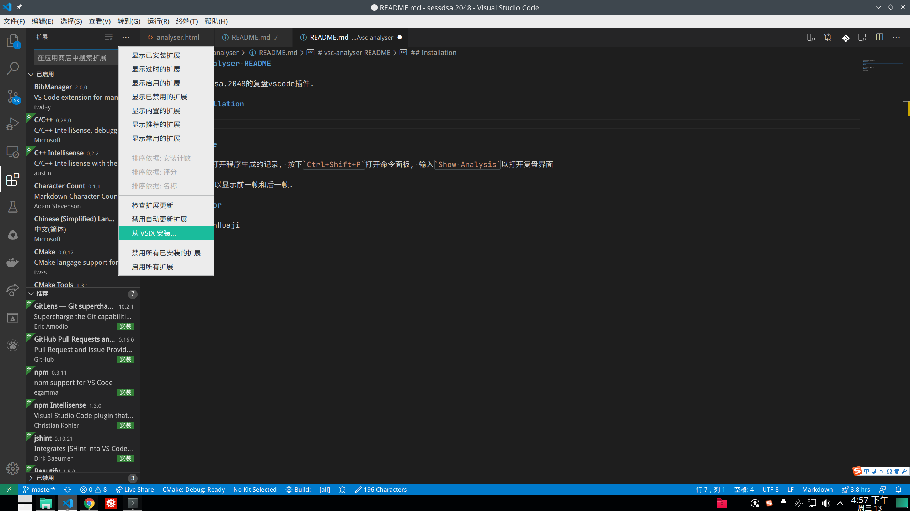

# vsc-analyser README

这是sessdsa.2048的复盘vscode插件.

## Installation

在vscode的`扩展`页面右上角菜单点击, 选择`从VSIX安装`本目录下的`vsix`文件.

## Useage

用vscode打开程序生成的记录, 按下`Ctrl+Shift+P`打开命令面板, 输入`Show Analysis`以打开复盘界面

或者在编辑器右下角点击`2048 analysis`打开复盘界面

按下`[,]`以显示前一帧和后一帧.

### Author

@HamiltonHuaji
